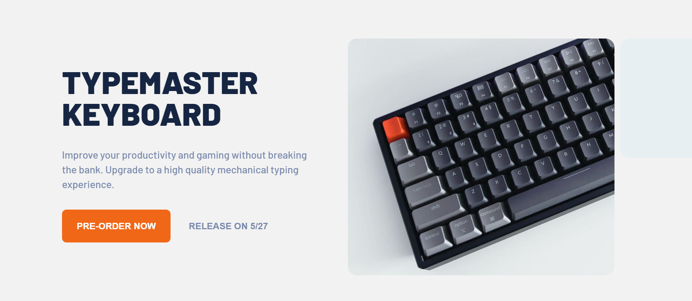
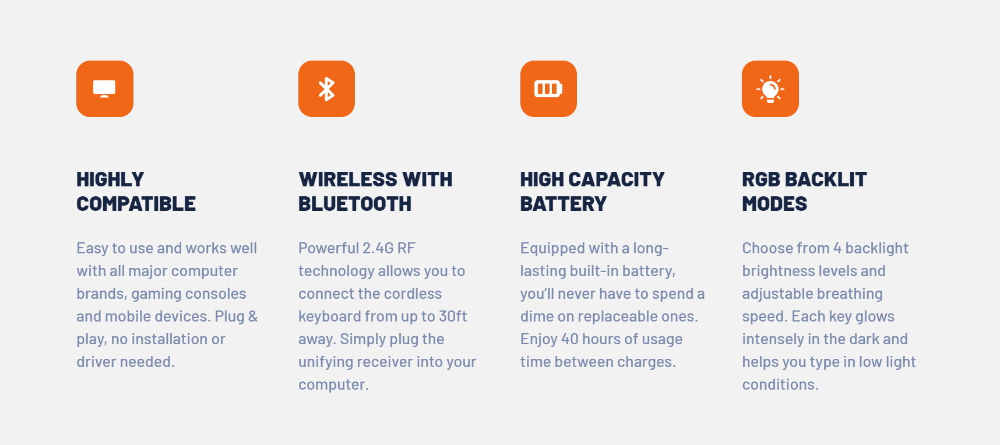

# Frontend Mentor - Typemaster pre-launch landing page solution

## Table of contents

- [Frontend Mentor - Typemaster pre-launch landing page solution](#frontend-mentor---typemaster-pre-launch-landing-page-solution)
  - [Table of contents](#table-of-contents)
  - [Overview](#overview)
    - [Screenshot](#screenshot)
    - [Links](#links)
  - [My process](#my-process)
    - [Built with](#built-with)
    - [What I learned](#what-i-learned)
    - [Continued development](#continued-development)
    - [Useful resources](#useful-resources)
  - [Acknowledgments](#acknowledgments)

## Overview

This is a solution to the [Typemaster pre-launch landing page challenge on Frontend Mentor]().

### Screenshot

### Links

- Solution URL: [Solution URL here](https://github.com/NunuAbuashvili/Typemaster-pre-launch-Landing-Page.git)
- Live Site URL: [Live site URL here](https://nunuabuashvili.github.io/Typemaster-pre-launch-Landing-Page/)

## My process

### Built with

- Semantic HTML5 markup
- CSS custom properties
- Flexbox
- CSS Grid
- Mobile-first workflow

### What I learned

This was a challenging project in terms of aligning images and content of the page in a way, that would lead to the best outcome for viewers with different screen sizes. While working through this project I came across a problem of making images responsive, as I wanted to include all of the images inside my HTML file and avoid manipulating them with media queries. I have found two great solutions to this problem: first, the <picture> element or  syntax; second, the object-fit property.

Also, this project helped me understand more about mix-blend-mode CSS property.

### Continued development

I would like to learn more about making images responsive in CSS.

### Useful resources

- [CSS Responsive Image Tutorial](https://www.freecodecamp.org/news/css-responsive-image-tutorial/) - This helped me understand what I should NOT do while working on responsive images;
- [A Guide to the Responsive Images Syntax in HTML](https://css-tricks.com/a-guide-to-the-responsive-images-syntax-in-html/#using-srcset) - This is an amazing article about the <picture> element and the  syntax.

## Acknowledgments

I would like to thank Bitcamp 101 (Georgia) for offering amazing lectures, and also, my mentor Paata Gharibashvili who has helped me a lot while working on different projects.
